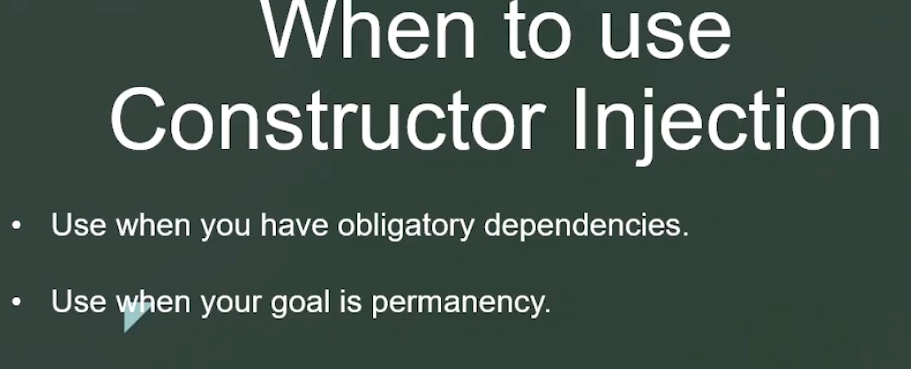
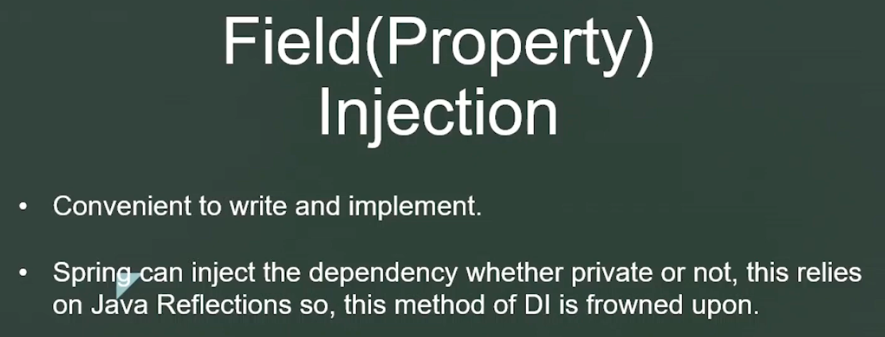

# Spring Module - IOC Container and Dependency Injection

* The Spring Framework acts as an Inversion of Control (IoC) Container by utilizing Dependency Injection. 
* IoC or Dependency Injection, refers to the ***process*** whereby 
  * ***objects define their dependencies***, 
  * but ***creation***, ***assembly*** and ***injection*** of those objects is performed by the ***Spring IoC container***.

https://www.baeldung.com/inversion-control-and-dependency-injection-in-spring


## Inversion of Control
Inversion of Control is a ***design principle*** in which ***control*** over certain parts of object-oriented design is ***inverted*** to achieve ***loose coupling***. 
* An simple way to think of this would be to Suppose a ***user*** has a ***car*** and drives to work each day. Currently, the user is in control of the car. However, if the user ***schedules*** an uber instead, the control is inverted from the user to the uber driver, allowing the user to focus on other tasks while still allowing the car to ultimately be driven to work.

In Spring, the ***IoC Container*** is responsible for ***instantiating***, ***configuring*** and ***assembling*** objects known as ***beans***. It does this by getting information from the ***XML file*** or annotations and assembling the objects accordingly. In Spring there are two types of IoC Containers, the ***BeanFactory*** and*** Application context***, which is built out of the Bean factory. More information on BeanFactory, ApplicationContext and Beans can be found in the [configuration lecture notes](./xml-vs-annotation-configuration.md).

The ***ApplicationContext*** interface is built on top of the ***BeanFactory*** with ***extra functionality***, such as simple integration with Spring AOP, event propagation, message resource handling, and application layer specific context (such as WebApplicationContext for web applications).
***ApplicationContext = BeanFactory + Spring AOP + event + messaging + WebApplicationContext***

## Dependency Injection
* Fundamentally, every framework implements at least some level of Inversion of Control. 
  * Callback
  * Pubsub
  * Promise(when success do sth, when fail do sth)
  * React useEffect hook (pass callbacks and dependency to useEffct, let it evoke the callbacks, when state of the dependency changes)
* ***Dependency Injection is a more specific term for what control is inverted with regard to the Spring Framework.*** As the name suggests, Dependency Injection is a design patters that removes dependencies of a program by ***providing the configuration*** in an ***external source***, such as an ***XML file*** and ***anotations*** This loosely ***coupled design*** then makes code easier to test, and implement in a wider variety of environments.(like smart light, all the smart thing, it does not required to hard connected to the signal cord, increase the fexibility and changability)

Dependency Injection can occur through the following methods:

* Constructor Injection: Dependency Injection accomplished when the ***container invokes a constructor with arguments to instantiate*** a bean in which each argument of said constructor represents a dependency.

* Setter Injection: Dependency Injection accomplished when the ***container calls setter methods on a bean after invoking a no-argument constructor to instatiate a bean.***

* Filed Injection


### Constructor Injection Examples
__XML Configuration__
```xml
<beans>
    <bean id = "order" class = "com.revature.models.Order">
        <constructor-arg ref="account"/>
        <constructor-arg ref="item"/>
    </bean>

    <bean id = "account" class = "com.revature.models.Account">
    </bean>

    <bean id = "item" class = "com.revature.models.Item">
    </bean>
</beans>
```


__Annotation Configuration__
```java
package com.revature.models;

import org.springframework.beans.factory.annotation.Autowired;

public class Order {
	private Account account;
	private int id;
        private Item item;

	@Autowired // multiple beans are distinguished by object type
	public Order(Account account, int id, Item item) {
		super();
		this.account = type;
		this.id = id;
		this.item = item;
	}

	...
}
```


__Java Configuration__
```java
package com.revature.config;

// import statements
...

@Configuration
@ComponentScan({ "com.revature.repository;com.revature.services" })
public class AppConfig {
	
	...
	
	@Bean(name = "orderService")
	public OrderService getOrderService() {
		OrderServiceImpl oserv = new OrderServiceImpl(getOrderDao()); //<--- consturctor injection
		return oserv;
	}
}
```

### Setter Injection Examples
__XML Configuration__
NOTE: XML Configuration does not directly support setter injection, rather, it is accomplished through properties
```xml
<beans>

    ...

    <bean id="accountServ" class="com.revature.services.AccountServiceImpl">
        <property name="accountDao" ref="accountDao"/>
    </bean>

    <bean id="orderServ" class="com.revature.services.OrderServiceImpl">
        <property name="orderDao" ref="orderDao"/>
    </bean>

    <bean id="itemServ" class="com.revature.services.ItemServiceImpl">
        <property name="itemDao" ref="itemDao"/>
    </bean>

</beans>
```


__Annotation Configuration__
```java
package com.revature.models;

import org.springframework.beans.factory.annotation.Autowired;

public class Order {
	private Account account;
	private int id;
        private Item item;

	@Autowired
	public void setItem(Item item) {
		this.item = item;
	}

	...
}
```


__Java Configuration__
```java
package com.revature.config;

// import statements
...

@Configuration
@ComponentScan({ "com.revature.repository;com.revature.services" })
public class AppConfig {
	
	...
	
	@Bean(name="accountService")
	public AccountService getAccountService() {
		AccountServiceImpl aserv = new AccountServiceImpl();
		as.setAccountDao(getAccountDao()); //<---setter injection
		return aserv;
	}
}
```

### Constructor vs Setter Injection
* Constructor Injection is more ***secure***, since dependencies are required to create an object, you are ***guaranteed*** to have each dependency populated
* Consturctor Injection enables the implementation of ***immutable*** objects
* Setter Injection allows for ***partial dependencies*** since Constructor injection requires all properties to be ***established upon bean instantiation.***
* Setter Injection occurs ***after*** constructor injection, essentially putting giving setter injection precedence over constructor injection
* Setter Injection can ***easily change values***, and does not create new bean instances, making it more ***flexible*** than constructor injection.
* Setter Injection can ***resolve circular references*** (i.e. if Object A and Object B are dependent on each other, setter injection can be used to resolve this, whereas Constructor injection would throw a BeanCurrentlyInCreationException).


### References
* [Spring 4.0 - IoC Container](https://docs.spring.io/spring/docs/4.0.x/spring-framework-reference/html/beans.html)
* [Inversion of Control and Dependency Injection - Martin Fowler](https://martinfowler.com/articles/injection.html)
* [IoC and Depedency Injection - Tutorials Teacher](https://www.tutorialsteacher.com/ioc/inversion-of-control)
